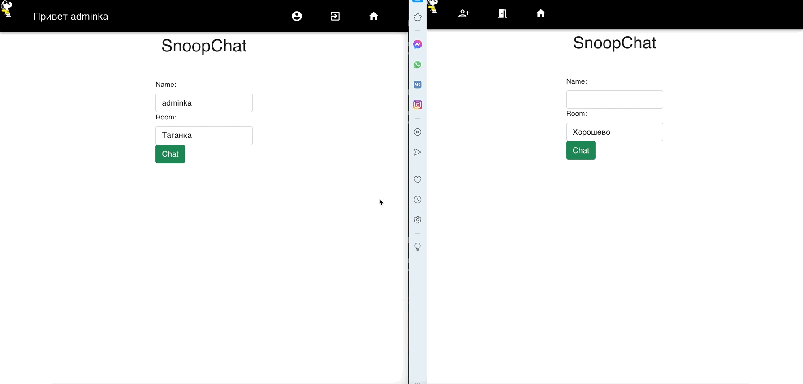
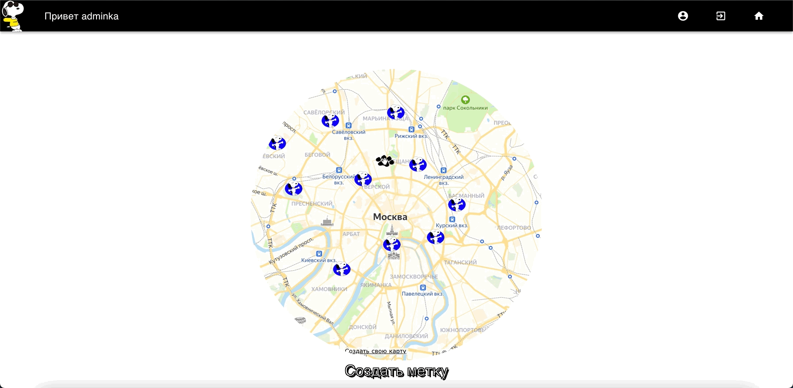

# animal-circle

## How to start

* Clone repository

* switch folder to 'server', type 'npm i'

* switch folder to 'client', type 'npm i'

after all packages and dependencies being installed, start the project using 

* 'npm start' in folder 'client'
* 'npm run dev' in folder 'server'

 
 

 
addPoint.gif
